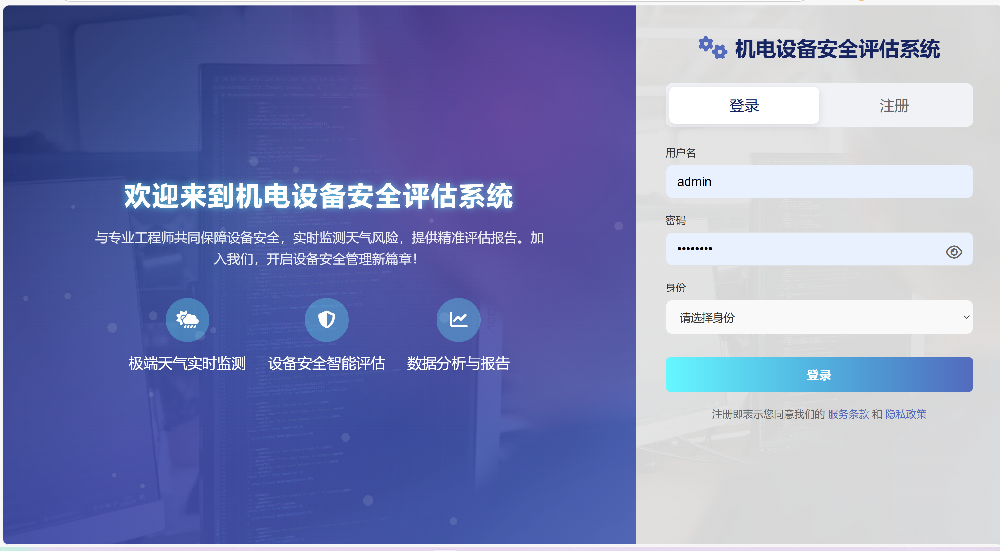
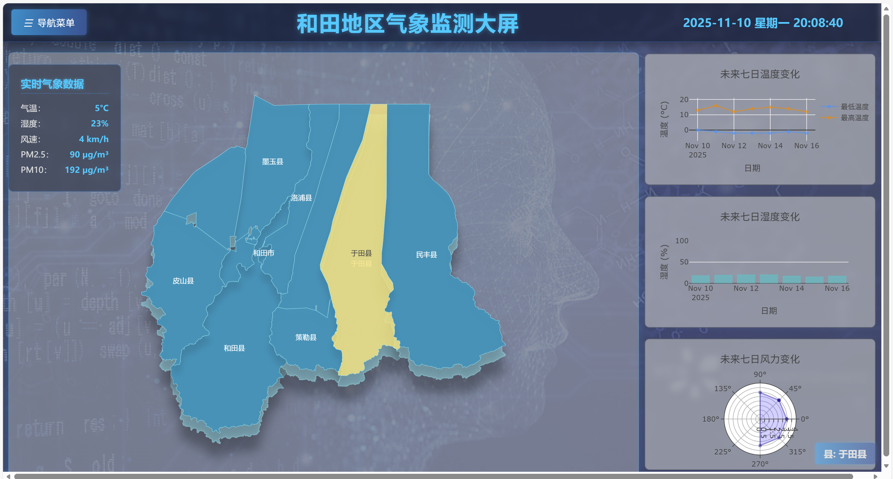
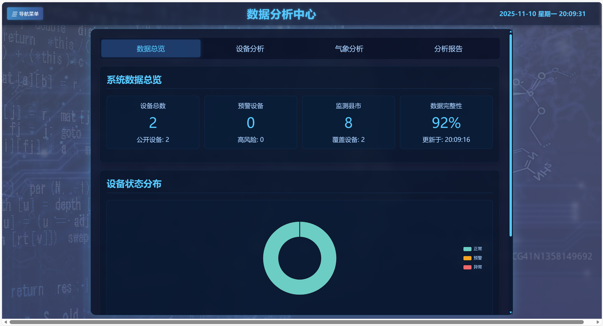
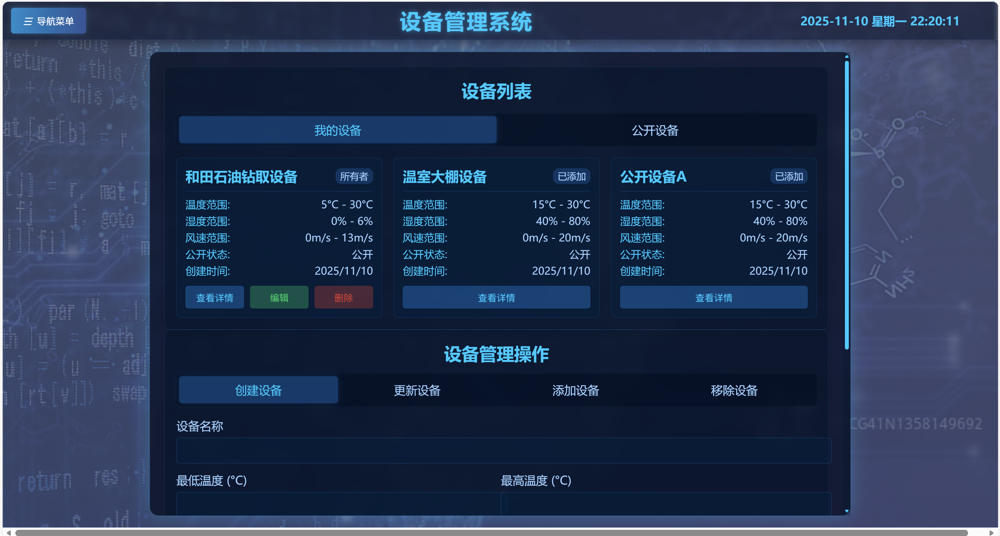
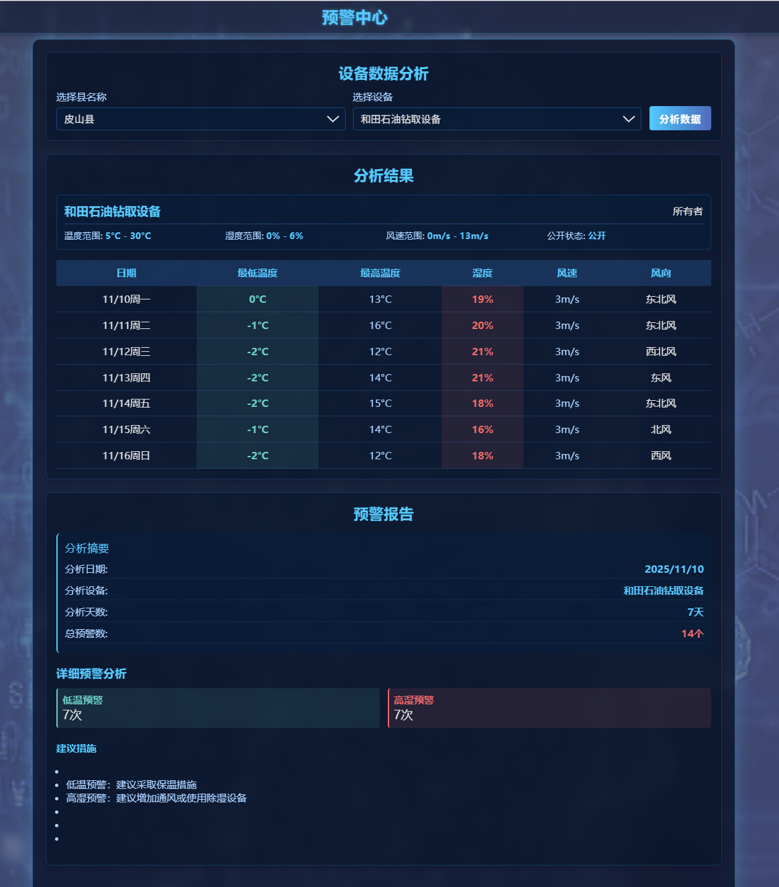
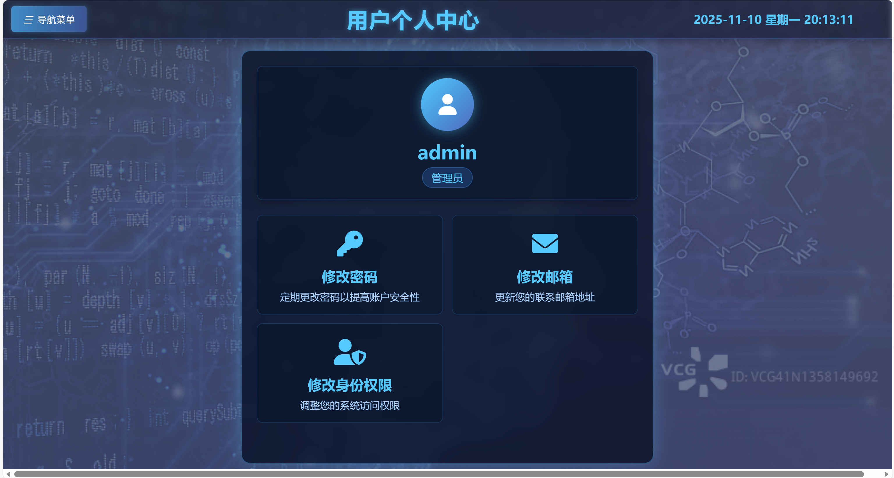

# FullStack-Safety-and-Operational-Assessment-of-Electromechanical-Equipment
(全栈项目)新疆和田地区极端气候下的机电设备安全运行评估系统
# 新疆和田地区机电设备极端天气安全评估系统

> 🌪️ 智能气象预警 · 设备安全管理 · 实时监控大屏

## 📖 项目简介

**新疆和田地区机电设备极端天气安全评估系统**是一款面向工业设备安全管理的智能气象预警平台。系统集成了实时气象监控、设备安全评估、预警预报等核心功能，为和田地区机电设备在极端天气条件下的安全运行提供全方位保障。

### 🌟 核心特色

- 🚨 **实时极端天气监控** - 多维度气象数据采集与分析
- 🔧 **智能设备管理** - 设备安全阈值设定与状态监控  
- 📊 **数据可视化大屏** - 直观展示气象与设备安全态势
- ⚡ **智能预警中心** - 多级预警机制，及时风险提示
- 👥 **多角色权限管理** - 分级授权，安全可控
- 📱 **响应式设计** - 支持多终端访问

## 👨‍💻 开发者
##### El-aguila  Github主页：https://github.com/El-aguilaZhwt
##### kashi  Github主页：https://github.com/xszzzz

## 🏗️ 系统架构

### 技术栈

**后端框架**：
- Spring Boot 3.5.7
- MyBatis Plus
- Spring Security + JWT
- Maven

**数据库**：
- MySQL 8.0

**前端技术**：
- html+css+javaScript
- ECharts 数据可视化

**部署环境**：
- JDK 21
- Tomcat 9+
- Nginx 反向代理

### ✨系统模块

### 🔐 智能认证系统
- 多角色登录（GUEST/USER/ADMIN）
- JWT令牌认证
- 注册即用，自动登录
- 权限分级控制

### 🌤️ 实时气象监控
- **县区实时数据**：温度、湿度、风速、PM2.5/PM10
- **未来7天预报**：基于经纬度的精准气象预测
- **多数据源集成**：支持县名称和经纬度双重查询
- **数据可视化**：图表化展示气象趋势

### 🔧 设备安全管理
- **设备信息管理**：创建设备、设置安全阈值
- **权限控制**：设备所有者、公开设备管理
- **阈值预警**：温度、湿度、风速安全范围监控
- **我的设备**：个性化设备收藏与管理

### 📈 数据分析中心
- **实时监控大屏**：全屏展示关键指标
- **历史数据追溯**：气象变化趋势分析
- **报表生成**：多维度数据分析报告

### 🚨 预警中心
- **多级预警机制**：绿色、蓝色、红色预警
- **设备安全评估**：基于气象数据的风险评估
- **处置建议**：针对性的安全防护措施

### 👤 用户个人中心
- **个人信息管理**：密码、邮箱、角色修改

## 💻 系统界面
- 登录-注册-鉴权界面

- 气象监控大屏

- 数据分析中心

- 设备管理系统

- 气象预报

- 预警中心

- 个人中心

## 📁 后端接口文档地址
- **[Safety-and-Operational-Assessment-of-Electromechanical-Equipment-under-Extreme-Weather-Conditions-of-Hetian-XinJiang/backend](https://github.com/El-aguilaZhwt/Safety-and-Operational-Assessment-of-Electromechanical-Equipment-under-Extreme-Weather-Conditions-)**  

## 🚀 环境要求

- JDK 21+
- MySQL 8.0+
- Maven 3.6+
- Redis 6.0+
